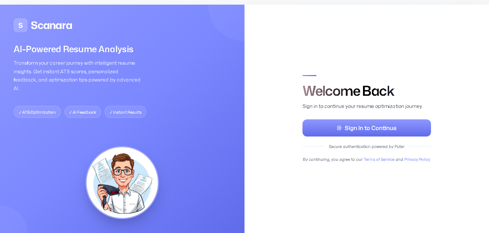
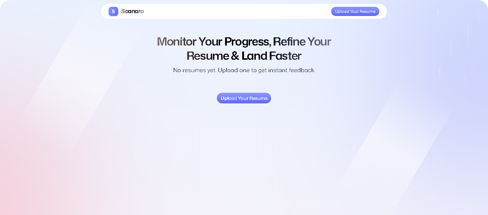
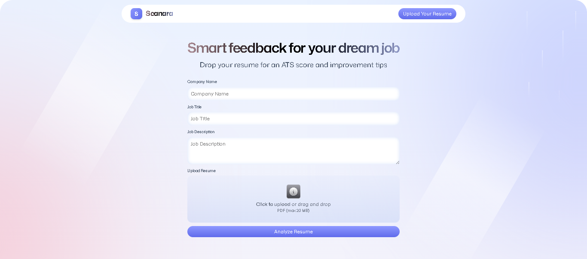
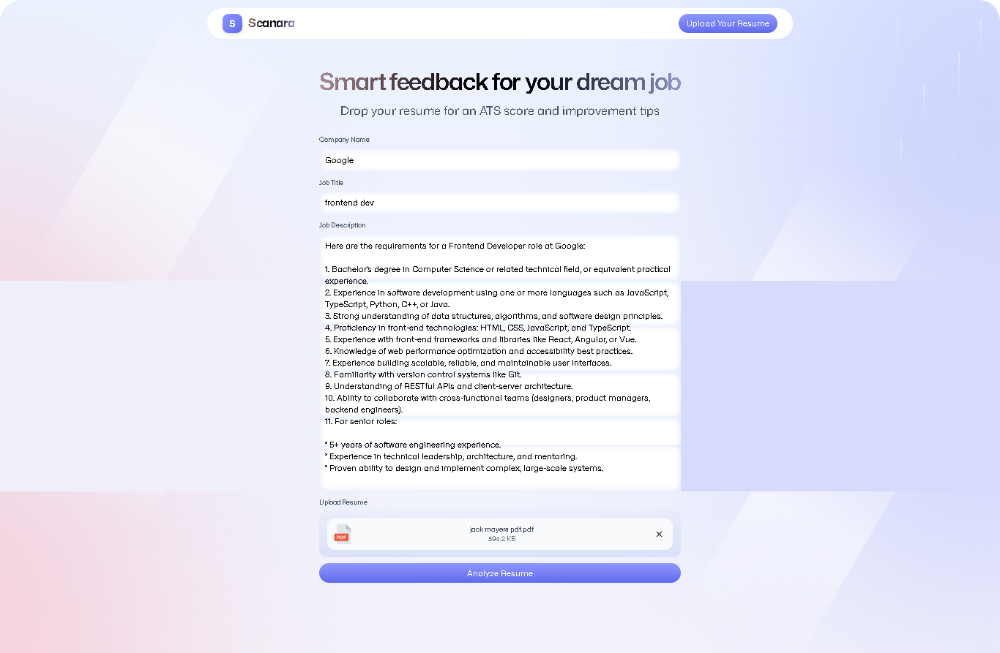
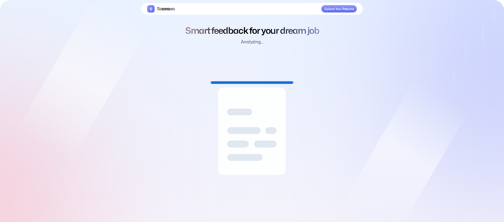
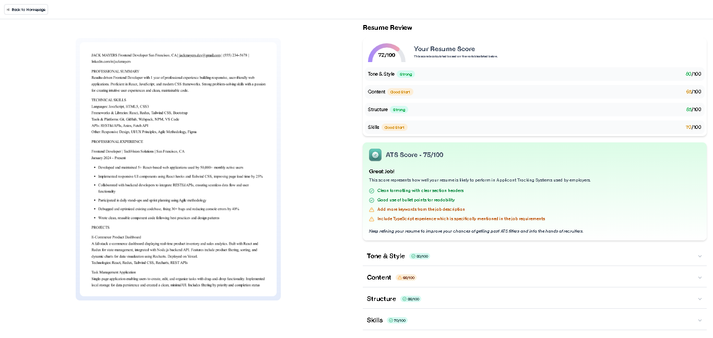

# Scanara - AI-Powered Resume Analyzer

Transform your career journey with intelligent resume insights. Get instant ATS scores, personalized feedback, and optimization tips powered by advanced AI.

---

## 📖 Table of Contents

1. [Project Overview](#project-overview)
2. [Project Structure](#project-structure)
3. [How It Works](#how-it-works)
   - [Login & Authentication](#1-login--authentication)
   - [Home Dashboard](#2-home-dashboard)
   - [Resume Upload & Job Details](#3-resume-upload--job-details-form)
   - [Analysis Process](#4-analysis-process)
   - [Analysis Results](#5-analysis-results)
4. [Key Features](#key-features)
5. [Technology Stack](#technology-stack)
6. [Getting Started](#getting-started)

---

## 🎯 Project Overview

**Scanara** is an AI-powered resume analysis platform designed to help job seekers optimize their resumes for Applicant Tracking Systems (ATS) and improve their chances of landing interviews.

The application analyzes your resume against specific job descriptions, providing detailed feedback on:
- **ATS Compatibility Score** - How well your resume performs with automated screening systems
- **Content Quality** - Assessment of your resume's relevance and impact
- **Structure & Formatting** - Evaluation of organization and readability
- **Skills Alignment** - How well your skills match job requirements
- **Tone & Style** - Professional language and presentation analysis

---

## 📁 Project Structure

```
scanara/
│
├── app/                          # Application source code
│   ├── components/               # Reusable React components
│   │   ├── Accordion.tsx        # Expandable feedback sections
│   │   ├── ATS.tsx              # ATS score display
│   │   ├── Details.tsx          # Detailed feedback sections
│   │   ├── FileUploader.tsx     # Drag-and-drop upload
│   │   ├── Logo.tsx             # Brand logo component
│   │   ├── Navbar.tsx           # Navigation bar
│   │   ├── ResumeCard.tsx       # Resume preview cards
│   │   ├── ScoreBadge.tsx       # Score status indicators
│   │   ├── ScoreCircle.tsx      # Circular score display
│   │   ├── ScoreGauge.tsx       # Score gauge visualization
│   │   └── Summary.tsx          # Score summary section
│   │
│   ├── lib/                     # Utility functions & libraries
│   │   ├── pdf2img.ts          # PDF to image conversion
│   │   ├── puter.ts            # Puter.js integration
│   │   └── utils.ts            # Helper functions
│   │
│   ├── routes/                  # Page components (routes)
│   │   ├── auth.tsx            # Authentication/login page
│   │   ├── home.tsx            # Dashboard/home page
│   │   ├── resume.tsx          # Resume review/results page
│   │   ├── upload.tsx          # Upload & analysis page
│   │   └── wipe.tsx            # Data management utility
│   │
│   ├── app.css                  # Global styles & Tailwind
│   ├── root.tsx                 # Root layout component
│   └── routes.ts                # Route configuration
│
├── public/                      # Static assets
│   ├── icons/                  # SVG icons
│   ├── images/                 # Project images
│   │   ├── login-signup.png        # Authentication screen
│   │   ├── upload-resume.png       # Home dashboard
│   │   ├── upload-screen-form.png  # Upload form
│   │   ├── upload-for-jackmayers.png # Sample upload
│   │   ├── analyzing-progress.png  # Loading/analysis screen
│   │   └── analysis-results.png    # Final results page
│   └── favicon.ico
│
├── constants/                   # Application constants
│   └── index.ts
│
├── types/                       # TypeScript type definitions
│   ├── index.d.ts
│   └── puter.d.ts
│
├── package.json                 # Dependencies & scripts
├── tsconfig.json               # TypeScript configuration
├── vite.config.ts              # Vite build configuration
├── react-router.config.ts      # Router configuration
├── Dockerfile                   # Docker configuration
├── .gitignore                  # Git ignore rules
└── README.md                   # Documentation

```

---

## 🔄 How It Works

### 1. Login & Authentication





When you first visit Scanara, you're greeted with a secure authentication screen. Here's how it works:

**Left Panel (Blue Gradient Background):**
- Scanara logo and branding
- Application tagline and description
- Key features highlighted with badges:
  - ✓ ATS Optimization
  - ✓ AI Feedback
  - ✓ Instant Results
- Visual preview of the application

**Right Panel (Sign-In Section):**
- Welcome message: "Welcome Back"
- Sign-in button powered by secure Puter.js authentication
- Security notice explaining the authentication system
- Easy account creation or sign-in with existing credentials

**What Happens:**
1. Click the "Sign In to Continue" button
2. Secure authentication modal appears
3. Sign in with your credentials or create a new account
4. Once authenticated, you're redirected to your dashboard

---

### 2. Home Dashboard





After successful authentication, you land on your personalized dashboard.

**Dashboard Features:**
- **Navigation Bar:** Scanara logo (clickable link to home) and "Upload Your Resume" button
- **Hero Section:** Welcoming headline and motivational subtitle
- **Resume Cards Grid:** All your previously analyzed resumes displayed as interactive cards, each showing:
  - Resume thumbnail preview
  - Company name and job title
  - Overall score with color-coded badge:
    - 🟢 Green (70-100): Excellent
    - 🟡 Yellow (50-69): Good, needs improvement
    - 🔴 Red (0-49): Needs significant work
  - Upload date
  - "View Details" button to access full analysis

**Empty State:**
- If you're new, a friendly message prompts you to upload your first resume
- Large "Upload Your Resume" button to get started

**Quick Actions:**
- Click any resume card to view detailed analysis
- Click "Upload Your Resume" to analyze a new resume
- All resumes are automatically saved and organized by date

---

### 3. Resume Upload & Job Details Form





This is where you provide the context for analysis. The form has four main sections:

**Section 1: Company Name**
- Text input field
- Enter the company you're applying to
- Example: "Google", "Microsoft", "Tech Startup Inc."

**Section 2: Job Title**
- Text input field
- Enter the specific position title
- Example: "Senior Frontend Developer", "Product Manager"

**Section 3: Job Description**
- Large text area for the complete job posting
- Copy and paste the entire job description
- Include all requirements, responsibilities, and qualifications
- More detail = Better AI analysis

**Section 4: Resume Upload**
- Drag-and-drop zone with visual gradient border
- Click to upload or drag your PDF file
- Supports PDF files up to 20MB
- After upload, you see a preview showing:
  - PDF icon
  - File name
  - File size
  - Remove/replace option

**Analyze Button:**
- Large blue gradient button at bottom
- Activated only when all fields are filled with valid data
- Click to start the AI analysis process

**Best Practices for Uploading:**
- Use the exact job title from the posting
- Include complete job description with all sections
- Ensure your resume PDF is not password-protected
- Double-check company name and job details for accuracy

---

### 4. Analysis Process



Once you click "Analyze Resume", the system springs into action with multiple processing stages:

**What Happens Behind the Scenes:**

1. **Uploading the File (2-3 seconds)**
   - Your resume PDF is securely uploaded to cloud storage
   - File validation ensures integrity
   - Progress indicator updates in real-time

2. **Converting to Image (3-5 seconds)**
   - PDF is converted to a high-quality image
   - This allows the AI to analyze your resume's visual layout
   - Formatting and design elements are preserved

3. **Uploading the Image (2-3 seconds)**
   - Converted image is uploaded to secure storage
   - Ready for AI analysis and processing

4. **Preparing Data (1-2 seconds)**
   - Your job description and resume information are formatted
   - Data is organized for AI processing
   - System prepares the analysis context

5. **Analyzing (10-30 seconds)**
   - Claude 3.7 Sonnet AI analyzes your resume
   - AI compares your experience against job requirements
   - AI evaluates content, structure, tone, and skills
   - ATS compatibility is assessed
   - Detailed feedback is generated

6. **Analysis Complete**
   - System generates your detailed results report
   - Page automatically redirects to results screen
   - Your analysis is saved to your dashboard

**Technical Details:**
- Uses advanced AI (Claude 3.7 Sonnet from Anthropic)
- Analyzes content relevance, keywords, and ATS compatibility
- Evaluates professional tone and presentation
- Assesses skills alignment with job requirements
- All processing is secure and private

---

### 5. Analysis Results



The results page is your comprehensive feedback report with actionable insights.

**Layout: Split-Screen Design**

**Left Panel (Resume Preview):**
- Full visual preview of your uploaded resume
- Sticky position - stays visible while scrolling
- Click to open full PDF in new tab
- Gradient border for visual appeal

**Right Panel (Detailed Analysis & Feedback):**

**A. Overall Score Card**
- Large circular gauge showing your overall score (0-100)
- Color-coded performance indicator
- "Your Resume Score" heading with explanation
- This score represents your resume's overall performance

**B. Category Scores (Four Key Areas)**

1. **Tone & Style Score (0-100)**
   - Professional language and consistency
   - Action verb strength and clarity
   - Overall voice and presentation

2. **Content Score (0-100)**
   - Relevance to job description
   - Achievement quantification and impact
   - Keyword optimization

3. **Structure Score (0-100)**
   - Section organization and flow
   - Visual hierarchy and readability
   - Formatting consistency

4. **Skills Score (0-100)**
   - Alignment with job requirements
   - Technical proficiency demonstration
   - Soft skills presentation

**C. ATS Compatibility Score**
- Dedicated score for Applicant Tracking System compatibility
- Critical for getting past automated screening
- Actionable tips for improvement, such as:
  - Adding relevant keywords from job description
  - Using standard section headings
  - Avoiding complex formatting and tables
  - Including both acronyms and full terms
  - Using standard fonts without graphics

**D. Detailed Feedback Sections (Expandable)**

Each category includes:
- **Strengths:** What you're doing well
- **Areas for Improvement:** Specific issues identified
- **Recommendations:** Actionable steps to enhance your resume
- **Examples:** Before/after suggestions with concrete improvements
- **Keywords:** Terms from the job description you should add

**How to Use These Results:**

1. Review your overall score to understand your resume's current state
2. Identify which categories need the most improvement
3. Prioritize ATS fixes first (most critical for screening)
4. Read through all detailed feedback sections
5. Take notes on specific recommendations
6. Reference your resume on the left to match feedback to sections
7. Make improvements to your resume
8. Re-upload to track progress and improvements

**Navigation Options:**
- Back button to return to dashboard
- Click resume preview to open full PDF
- Save or export your analysis
- Compare with previous versions

---

## ✨ Key Features

### 🔐 Secure Authentication
- Browser-based authentication via Puter.js
- Privacy-first approach - your data stays secure
- No passwords stored locally
- Quick and seamless sign-in

### 📤 Easy Resume Upload
- Simple drag-and-drop interface
- PDF support up to 20MB
- Instant file validation and preview
- Visual confirmation before analysis

### 🤖 AI-Powered Analysis
- Advanced AI evaluation using Claude 3.7 Sonnet
- Job-specific feedback tailored to your target role
- Comprehensive scoring across multiple categories
- Contextual recommendations

### 📊 Detailed Feedback
- Overall score (0-100) with visual indicators
- Four category-specific scores
- ATS compatibility assessment with improvement tips
- Actionable recommendations for each section
- Strengths and weaknesses clearly identified

### 💾 Resume History
- Store all analyzed resumes in one place
- Track improvements over time
- Easy access to previous analyses
- Compare multiple versions

### 📱 Responsive Design
- Works seamlessly on desktop, tablet, and mobile
- Modern, intuitive user interface
- Fast and smooth experience
- Optimized for all screen sizes

---

## 💻 Technology Stack

### Frontend
- **React 19** - Modern UI framework
- **React Router v7** - Client-side routing
- **TypeScript** - Type-safe code
- **Tailwind CSS** - Utility-first styling
- **Vite** - Fast build tool and dev server

### Backend & Services
- **Puter.js** - Serverless backend infrastructure
  - Authentication system
  - Cloud file storage
  - Key-value database
  - AI integration
- **Claude 3.7 Sonnet** (Anthropic) - Advanced AI analysis
- **PDF.js** - PDF rendering and conversion

### Development Tools
- **Zustand** - Lightweight state management
- **TypeScript** - Type checking and safety
- **ESLint** - Code quality
- **Prettier** - Code formatting

---

## 🚀 Getting Started

### Prerequisites

Before you begin, ensure you have:
- **Node.js** v18 or higher - [Download here](https://nodejs.org/)
- **npm** or **yarn** (comes with Node.js)
- **Git** - [Download here](https://git-scm.com/)
- A modern web browser

### Installation

**Step 1: Clone the Repository**
```bash
git clone https://github.com/Maxmilla-code/Ai-resume-generator.git
cd ai-resume-analyzer
```

**Step 2: Install Dependencies**
```bash
npm install
```

**Step 3: Start Development Server**
```bash
npm run dev
```

**Step 4: Open in Browser**
Navigate to: `http://localhost:5173`

### Build for Production

```bash
# Create optimized production build
npm run build

# Preview production build locally
npm run preview
```

### Docker Deployment

```bash
# Build Docker image
docker build -t scanara .

# Run container
docker run -p 5173:5173 scanara
```

---

## 🎨 Design Highlights

- **Color Scheme:** Modern blue gradients with supporting status colors
- **Typography:** Clean, readable fonts with clear hierarchy
- **User Experience:** Intuitive flow from authentication → upload → analysis → results
- **Visual Feedback:** Real-time progress indicators and status updates
- **Accessibility:** High contrast, semantic markup, keyboard navigation

---

## 🔒 Security & Privacy

- **Encrypted Cloud Storage** - All resumes stored securely
- **Secure Authentication** - Browser-based with Puter.js
- **User Data Control** - You own your data, not us
- **No Data Selling** - Your information is never sold
- **Private AI Analysis** - Processing is secure and confidential

---

## 🤝 Contributing

We welcome contributions! Here's how you can help:

- Report bugs via GitHub Issues
- Suggest features and improvements
- Submit pull requests with enhancements
- Improve documentation and examples

---

## 📞 Support

- Check our documentation for detailed guides
- Review the FAQ section
- Open an issue on GitHub for bugs
- Contact us for feature requests

---

<div align="center">
  <p><strong>Made with ❤️ by maxmilla</strong></p>
  <p>Helping job seekers land their dream jobs, one resume at a time.</p>
</div>